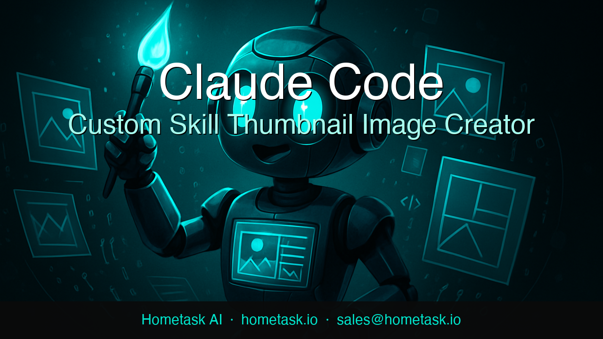

# Thumbnail Creator

AI-powered YouTube thumbnail generator for **Hometask AI**. Give it a title, subtitle, and a vibe — it uses **Claude** to write the image prompt and pick a color palette, **OpenAI** to generate the background art, and **Pillow** to composite the final image with text and a branded footer.

---

## Sample Output

> Vibe: `bold dark teal black no overlay`



*1280 × 720 px — generated in ~40 seconds for ~$0.04*

---

## Features

- **Claude-powered** prompt engineering and color palette selection with prompt caching
- **OpenAI gpt-image-1** background art featuring a robot character
- **Pillow** compositing — title, subtitle, branded footer
- Fully configurable via `.env` — no code changes needed for new thumbnails
- Interactive prompts for any missing `.env` values at runtime
- `/thumbnail` Claude Code skill for one-command generation
- `github_manager.py` — git init, GitHub repo creation, and push from `.env` credentials
- Jupyter notebook for interactive use

---

## Project Structure

```
thumbnail-creator/
├── .claude/
│   ├── commands/thumbnail.md   # /thumbnail Claude Code slash command
│   └── settings.json           # Tool permissions
├── src/
│   ├── thumbnail.py            # CLI entry point — orchestrates the full pipeline
│   ├── claude_helper.py        # Claude API calls (prompt + palette, with caching)
│   ├── image_generator.py      # OpenAI gpt-image-1 image generation
│   ├── compositor.py           # Pillow — crop, text overlays, footer
│   └── github_manager.py       # Git init, GitHub repo creation, push
├── output/                     # Generated thumbnails (gitignored)
├── assets/                     # Static assets and sample images
├── docs/
│   └── plan.md                 # Full project documentation
├── notebooks/
│   └── thumbnail.ipynb         # Interactive Jupyter version
├── .env.example                # Template — copy to .env and fill in values
├── .gitignore
├── prompt.txt                  # Original project brief
└── requirements.txt
```

---

## Setup

### 1. Clone and install dependencies

```bash
git clone https://github.com/stevebuonincontri/thumbnail-creator.git
cd thumbnail-creator
pip install -r requirements.txt
```

### 2. Configure `.env`

```bash
cp .env.example .env
```

Open `.env` and fill in:

| Variable | Description |
|---|---|
| `ANTHROPIC_API_KEY` | Get at [console.anthropic.com](https://console.anthropic.com) |
| `OPENAI_API_KEY` | Get at [platform.openai.com](https://platform.openai.com) |
| `COMPANY_NAME` | Displayed in the footer (e.g. `Hometask AI`) |
| `COMPANY_URL` | Displayed in the footer (e.g. `hometask.io`) |
| `COMPANY_EMAIL` | Displayed in the footer |
| `DEFAULT_VIBE` | Mood/style — see [Vibe Examples](#vibe-examples) |
| `TITLE` | Main heading (leave empty to be prompted) |
| `SUBTITLE` | Sub-heading (leave empty to be prompted) |
| `CLAUDE_MODEL` | Anthropic model (default `claude-sonnet-4-6`) |
| `IMAGE_WIDTH` | Output width in px (default `1280`) |
| `IMAGE_HEIGHT` | Output height in px (default `720`) |
| `GITHUB_TOKEN` | Personal access token — repo scope |
| `GITHUB_USERNAME` | Your GitHub username |
| `GITHUB_REPO` | Repo name (default `thumbnail-creator`) |
| `GITHUB_BRANCH` | Branch (default `main`) |

---

## Usage

### Via Claude Code skill (recommended)

Open this folder in Claude Code and type:
```
/thumbnail
```

### Via command line

```bash
python3 src/thumbnail.py
```

Override any `.env` value with a flag:
```bash
python3 src/thumbnail.py --title "My Video" --vibe "dark tech"
```

Generate and push to GitHub in one command:
```bash
python3 src/thumbnail.py --push
```

### Via Jupyter notebook

```bash
jupyter notebook notebooks/thumbnail.ipynb
```

---

## GitHub Management

`src/github_manager.py` manages the git/GitHub lifecycle entirely from `.env` credentials.

```bash
# First time — init local repo, create GitHub repo, push
python3 src/github_manager.py

# Push updates after making changes
python3 src/github_manager.py --push

# Check git status and remotes
python3 src/github_manager.py --status
```

---

## Vibe Examples

Change `DEFAULT_VIBE` in `.env` to instantly change the look:

| Vibe | Feel |
|---|---|
| `bold dark teal black no overlay` | Dark teal + black, clean AI image, teal footer |
| `bold energetic` | Bright reds/oranges, dynamic robot pose |
| `dark tech` | Deep blues and purples, sleek futuristic feel |
| `friendly professional` | Clean blues, approachable robot |
| `retro pop` | Vintage color palette, playful illustration style |
| `minimalist elegant` | Monochrome with one accent color |

---

## Cost Estimate

| Step | Provider | Cost |
|---|---|---|
| Image prompt | Claude | ~$0.002 |
| Color palette | Claude | ~$0.001 |
| Background art | OpenAI gpt-image-1 | ~$0.040 |
| **Total** | | **~$0.043** |

Prompt caching on Claude calls reduces Claude cost ~90% after the first run with the same vibe.

---

## Architecture

```
/thumbnail (Claude Code skill)
        │
        ▼
src/thumbnail.py          ← CLI orchestrator
    │       │       │
    ▼       ▼       ▼
claude_   image_   compositor.py
helper.py generator.py
    │           │           │
Claude API  OpenAI      Pillow
(prompt +   gpt-image-1 (crop + text
 palette)   (AI art)    + footer)
```

---

## Company

**Hometask AI** · [hometask.io](https://hometask.io) · sales@hometask.io
